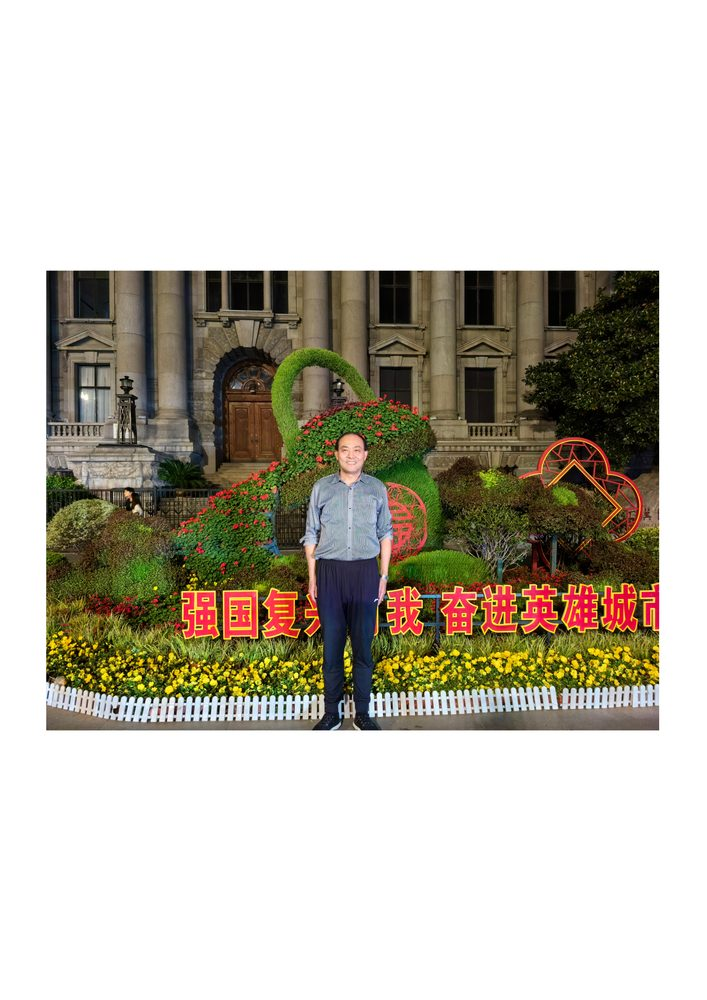

# 吴文全

- 栏目：人工智能系
- 日期：2026-04-29
- 原文：https://site.gcc.edu.cn/xydw/rgzn/wlwgcybyjsjys1/b020752332ed4d05bb85489ec61cee1d.htm
- 照片：
  - 人工智能系\吴文全.jpg

吴文全，男，1972年01月10日出生，江西抚州人，汉族。毕业于中国计量大学和海军工程大学，分获学士学位和硕士学位。

潜心进行教学研究，获得教学科研一二三等奖各一次，大学教学成果一二等奖各一次，发表相关教学论文20篇，讲授课程《模拟电子线路》，参加全军统考学生均分全军第一。指导电路与系统专业硕士研究生10人，电子通信系统工程硕士5人。指导硕士论文评为大学优秀硕士论文，指导研究生参加第十一届中国研究生电子设计竞赛获全国一等奖，评为全国总决赛优秀指导教师。

积极进行科研工作，完成各类科研项目二十余项，获得军队科技进步奖二三等奖共四项。荣立三等功二次，获得军队院校育才银奖、大学优秀教员等奖励。
