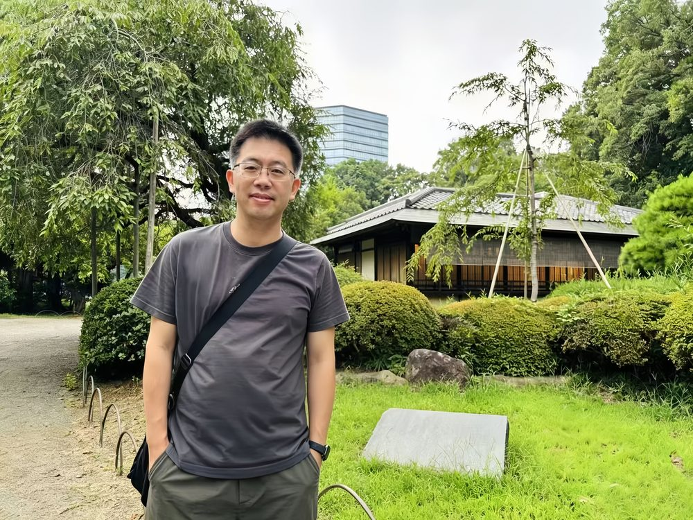

# 周俊峰

- 栏目：人工智能系
- 日期：2026-04-29
- 原文：https://site.gcc.edu.cn/xydw/rgzn/wlwgcybyjsjys1/7d8de53c36e549f4b7476dfc6913cf67.htm
- 照片：
  - 人工智能系\周俊峰.jpg

周俊峰，男，博士，博士后，高级工程师。1999年中南大学机械电子专业本科毕业，2006年中南大学机械电子专业硕博连读获博士学位。参与多项国家级、省部级项目，包括国家高科技研究发展计划（863计划）项目1项、国家自然科学基金项目1项、国防科工委项目2项、国家计委项目1项、多项省级课题项目以及横向科研项目。获得国家科学技术进步奖二等奖 1 项，省部级一等奖3项，省部级二等奖1项, 省级重大科学技术成果1项。参与国家标准1项，团体和地方标准3项。申请发明专利6项，授权发明专利4项，获实用新型7项，获软件著作权5项。 在国内外公开刊物发表论文10余篇。
