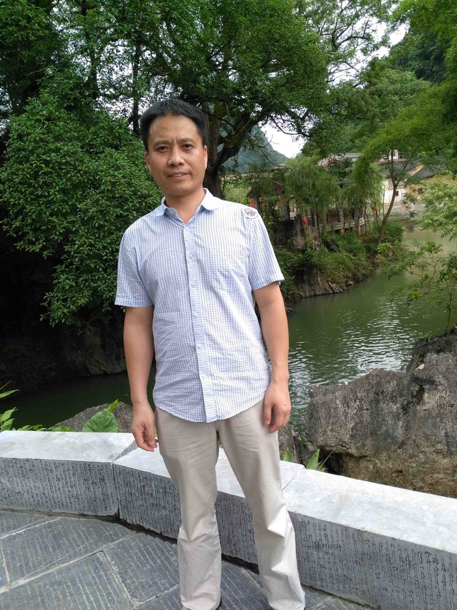

# 梁建军

- 栏目：人工智能系
- 日期：2026-04-29
- 原文：https://site.gcc.edu.cn/xydw/rgzn/wlwgcybyjsjys1/4205c265278747099c88b7c9ebe026a3.htm
- 照片：
  - 人工智能系\梁建军.jpg

梁建军，硕士，讲师。江西师范大学本科、广东工业大学硕士研究生毕业。从事物联网技术应用方向研究，参与一项广东省教育科研项目、主持一项校企产学合作协同育人项目、主持2项校级教改项目，主持的广东省学校优秀教学创新成果（职业教育）获得校级一等奖。发表期刊学术论文2篇，参与发表核心期刊学术论文1篇，以第二作者发表期刊学术论文2篇，获得实用新型专利2项。指导学生参加“第九届中国大学生服务外包创新创业大赛”荣获企业命题类团体一等奖，指导学生参加第六届蓝桥杯全国软件和信息技术专业人才大赛全国总决赛并获得C/C++程序设计大学B组三等奖。
