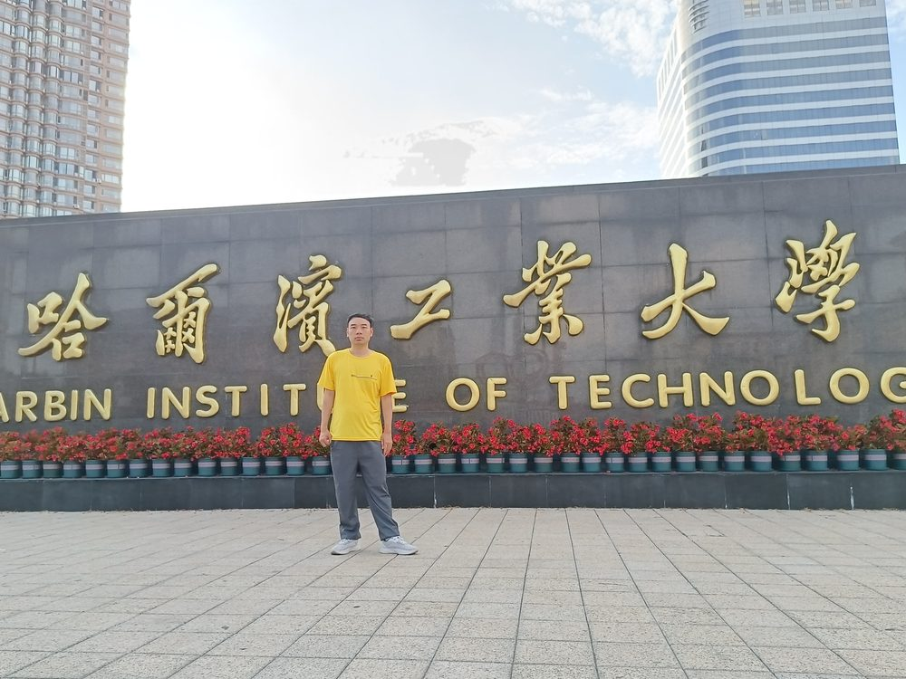

# 欧伟恒

- 栏目：人工智能系
- 日期：2026-04-29
- 原文：https://site.gcc.edu.cn/xydw/rgzn/wlwgcybyjsjys1/cc0b02dcd1a54608941c52fc76fe05f3.htm
- 照片：
  - 人工智能系\欧伟恒.jpg

欧伟恒，工程师，2011年获北京理工大学自动化学士学位，2015年获北京理工大学软工工程硕士学位，先后参与的多个广东省通信建设大型、重点项目获国家、省级优质工程奖，作为技术研发核心成员，参与多个项目研发并获奖，同时参编多项技术标准与专业规范制定，并在国内外期刊发表多篇论文。

一、参与建设获奖项目：

1、中国铁塔广东省分公司深茂高铁江茂段公网覆盖工程，国家优质工程金奖；

2、中国电信创新孵化(南方)基地一、二、三期机电项目，度优质工程一等奖。

二、技术研发与创新成果：

1、主持的研发项目“PMGenius 智能项管系统开发研究项目”，获“省质量创新发表赛三等奖”和“广东省工程勘察设计行业协会科学技术三等奖”；

2、参与的研发“BIM 模型自动审查软件开发研究项目”获中国图学学会第十届全国 BIM 大赛二等奖；

三、编制《轨道交通电磁兼容检测规范》等 5 项专业规范；

四、发表《共建共享模式下 4G/5G 网络质量保障及问题解决策略研究》、《物联网环境下基于人工智能的图像检测系统设计与研究》等多篇论文。
