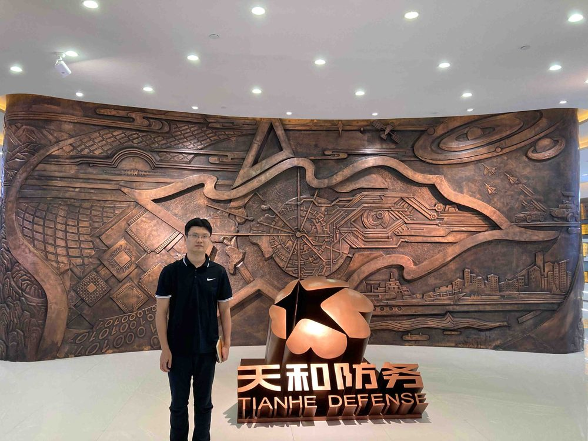

# 汤义

- 栏目：人工智能系
- 日期：2026-04-29
- 原文：https://site.gcc.edu.cn/xydw/rgzn/wlwgcybyjsjys1/2fc3e17a2088481eb33bdc54310b3426.htm
- 照片：
  - 人工智能系\汤义.jpg

汤义，男，计算机专业博士，副教授，“双师双能型”教师。曾就读华南理工大学获博士学位，而后在深圳大学信息与通信工程专业从事博士后研究工作。拥有部队、研究所及企业管理（曾任某部队通信所所长、工信部电子第五研究所中国赛宝低空通航实验室常务副主任、科技公司总经理等）等方面丰富实践经历。现为广州商学院信息技术与工程学院专任教师，主要承担《数据结构》《数据库原理及应用》等课程教学。进入广州商学院以来：以第一作者发表SCI一区TOP期刊论文1篇、SCI二区期刊论文1篇、EI期刊5篇及其它中文核心论文多篇，总计18篇论文；主持省部级课题2项、市厅级1项、校级1项；获软件著作权12项。
