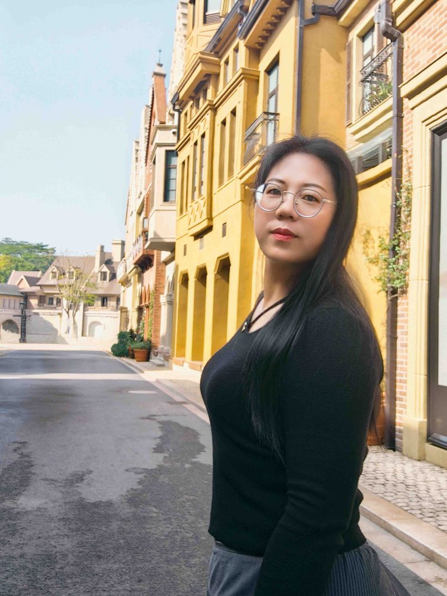

# 胡允娥

- 栏目：人工智能系
- 日期：2026-04-28
- 原文：https://site.gcc.edu.cn/xydw/rgzn/wlwgcybyjsjys1/ae95fcef8cd74ba790657fb172ea14c5.htm
- 照片：
  - 人工智能系\胡允娥.jpg

胡允娥，副教授，人工智能系副系主任，电子与通信工程专业硕士，毕业于华南理工大学。本科毕业于山东理工大学获得通信工程工学学士和法学学士双学士。近5年来指导学生参加全国电子设计大赛、全国大学生软件设计大赛、全国大学生计算机设计大赛、蓝桥杯等多项赛事，并获得20余个国家级及省级奖项。主持或参与了省级、校级及横向项目《基于RIS辅助空间调制与分组相位偏移技术服务》、《基于ROS的智能捡球机器人》等10余项，发表高水平论文《RIS-aided Spatial Modulation with Grouping Phase Shifts》、《Spatial Modulation with Hybrid Constellations》等6篇，《智慧农业物联网环境监控系统V1.0》专利1项。参与编写《高校创新创业教育人才培养模式研究》和《人工智能与可持续发展研究》教材两部。
