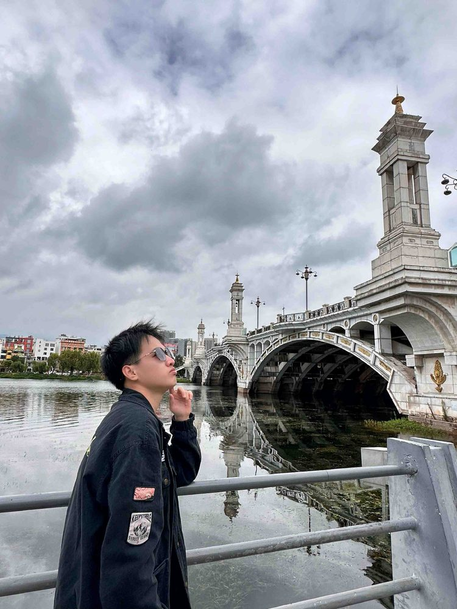

# 谢翊

- 栏目：人工智能系
- 日期：2026-04-29
- 原文：https://site.gcc.edu.cn/xydw/rgzn/wlwgcybyjsjys1/cc22ee689c8642ecbc6cac75b8d2c0c7.htm
- 照片：
  - 人工智能系\谢翊.jpg

谢翊，硕士。研究方向为人工智能、多模态以及物联网技术等。硕士毕业于广州大学。已发表信息检索领域顶级会议CIKM一篇。
