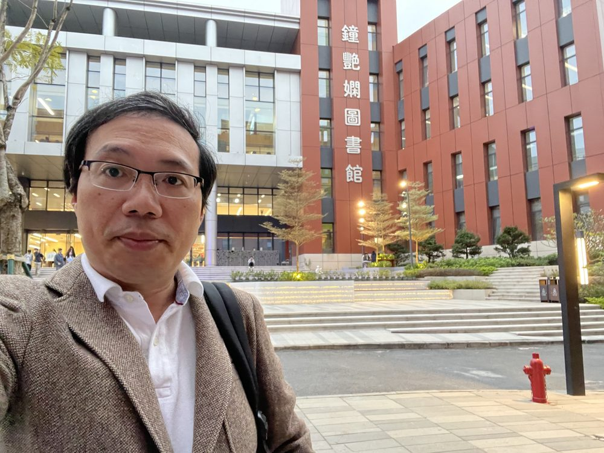

# 魏静

- 栏目：人工智能系
- 日期：2026-04-29
- 原文：https://site.gcc.edu.cn/xydw/rgzn/wlwgcybyjsjys1/4015a89809944332ac775b743ac14134.htm
- 照片：
  - 人工智能系\魏静.jpg

魏静，硕士，广东潮州人。2008年在厦门大学通信与信息系统专业获得硕士学位，之后在音视频实时通信、社交平台、支付及IoT等领域从事软件开发及架构工作。2025年7月加入广州商学院，现任信息技术与工程学院专任教师。
