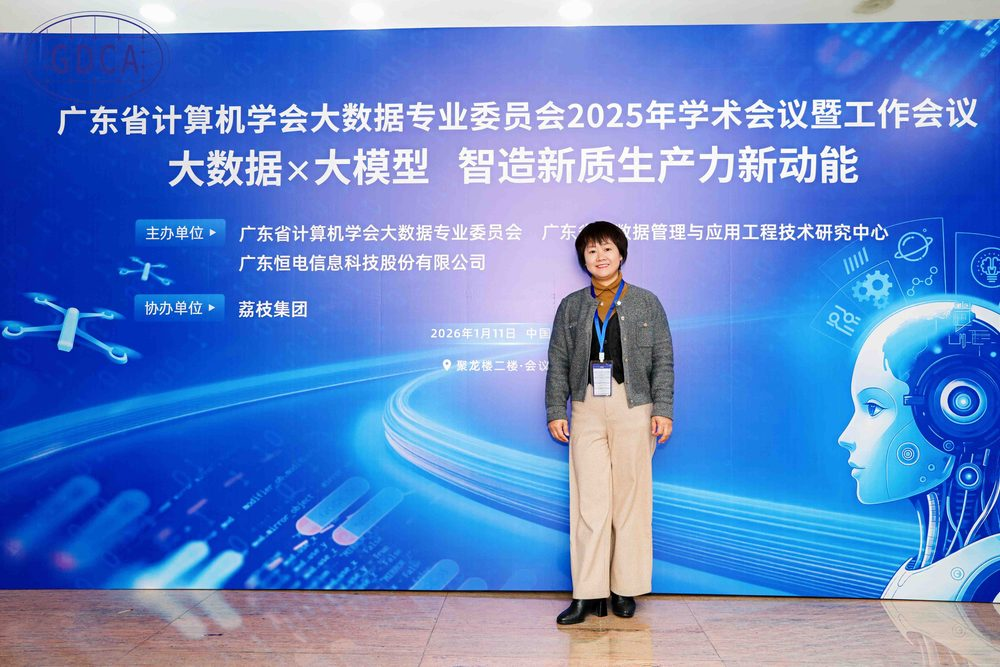

# 郑冬花

- 栏目：信息系统与智能决策教研室
- 日期：2026-04-30
- 原文：https://site.gcc.edu.cn/xydw/dsjjsygc/xxxtyznjcjys1/e8bbd69670694a92a509626e47a7163b.htm
- 照片：
  - 信息系统与智能决策教研室\郑冬花.jpg

郑冬花，副教授，现任大数据技术与工程系副主任，信息管理与信息系统专业负责人，广东省计算机学会大数据专业委员员委员，华南理工大学访问学者，广州商学院“双师双能型”教师。长期深耕于软件工程领域的教学与科研工作。主攻研究方向是数据挖掘和数据分析，主持省级项目2项及其他教科研项目8项，在国内外重要刊物上发表论文十余篇，参与编写教材2篇，主讲《面向对象程序设计》《python程序设计》《数据库原理与应用》等核心课程已逾24年，在教学上荣获2021和2022年度校级优秀教学奖，2025年校级优秀科研奖。2021年度课程思政优秀教学案例二等奖、2020中青年教师教学大赛优秀奖，2020年网络教学优秀教师等。
