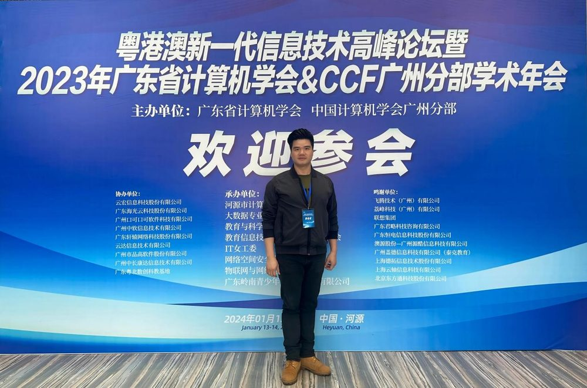

# 林树青

- 栏目：大数据工程教研室
- 日期：2026-04-30
- 原文：https://site.gcc.edu.cn/xydw/dsjjsygc/dsjgcjys1/43124f714f614c2c88f69e65c3511e33.htm
- 照片：
  - 大数据工程教研室\林树青.jpg

林树青，中共党员，教授。毕业于蒙古乌兰巴托研究大学电子信息工程专业，硕士研究生。广东省计算机学会数据科学与大数据专委会委员。曾先后多次获得学校“优秀教职工”3次，多次获得“优秀管理工作者”、绩效考核“优秀”奖，获得学校“优秀教师”，“优秀共产党员”，“结对子”优秀个人等称号。主持厅级项目1项，参加多个省级、厅级课题研究。参编《办公软件高级应用与实践》《数据库原理与应用》等教材2部。公开发表各级别计算机应用论文20余篇。
