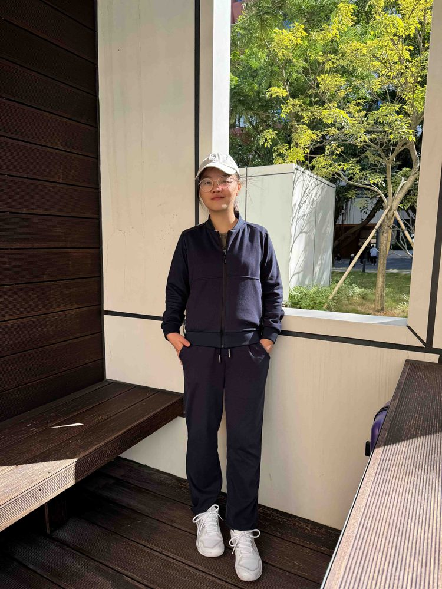

# 卢利敏

- 栏目：大数据技术与工程系
- 日期：2026-04-30
- 原文：https://site.gcc.edu.cn/xydw/dsjjsygc/sjkxyfxjys1/bd8c4dfd8ee148f6b597bdbf85584bd4.htm
- 照片：
  - 大数据技术与工程系\卢利敏.jpg

卢利敏，硕士研究生，毕业于广东工业大学计算机科学与技术专业，本科毕业于江西理工大学计算机科学与技术专业。现任广州商学院专任教师，主要从事计算机相关课程的教学与科研工作。具备扎实的专业基础与良好的科研素养，曾发表CCF-C类会议论文2篇，并获得软件著作权1项。曾就职于广州农村商业银行总行金融科技部，从事信息系统开发与项目管理工作，参与并主导多个信息化系统建设项目，具备扎实的软件开发能力与工程实践经验。致力于将企业实践与课堂教学相结合，提升学生的数据分析能力与工程应用能力。
