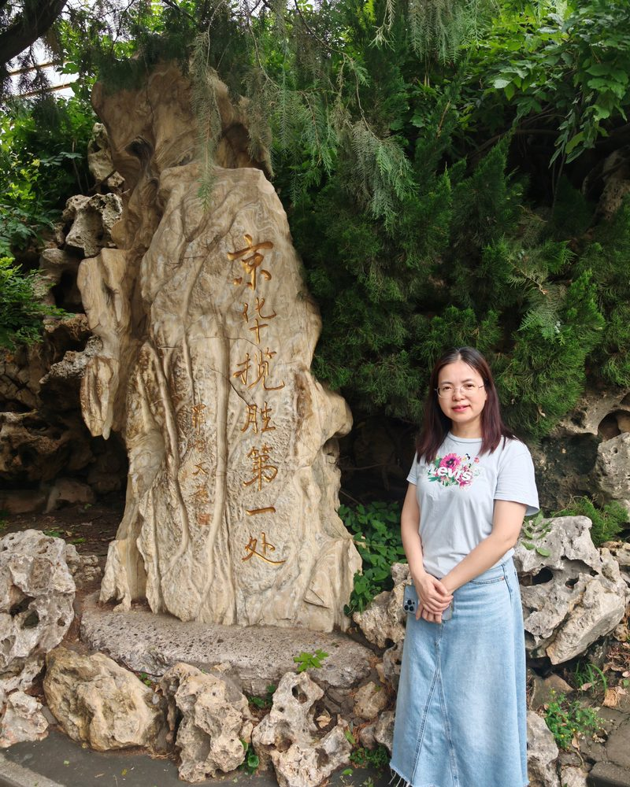

# 叶丽珠

- 栏目：大数据技术与工程系
- 日期：2026-04-30
- 原文：https://site.gcc.edu.cn/xydw/dsjjsygc/sjkxyfxjys1/0348e96e82fc403dbf2746010bb6d7d3.htm
- 照片：
  - 大数据技术与工程系\叶丽珠.jpg

叶丽珠，教授，硕士生导师，大数据技术与工程系系主任。广东省大数据专委会委员，广州商学院教学督导、学术委员会委员。研究方向为数据挖掘、大数据与人工智能应用。主持省级项目4项及其他教科研项目20余项，主编教材12部，发表论文20余篇，获省科技进步奖二等奖1项及软著与专利4项。个人获评广东省民办高校“优秀教师”等荣誉18项，指导学生学科竞赛获国家级、省级奖项26项。
