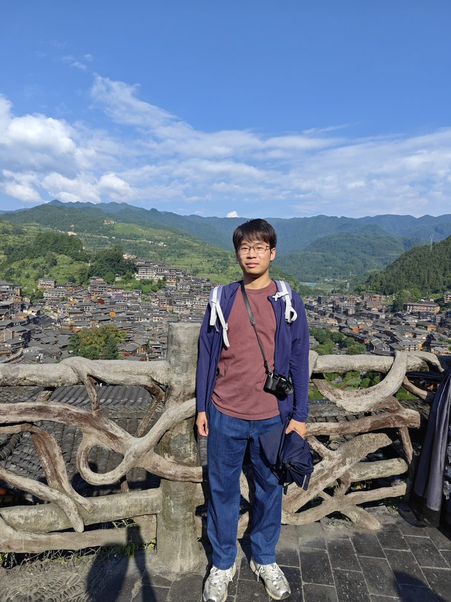

# 庄纬豪

- 栏目：大数据技术与工程系
- 日期：2026-04-30
- 原文：https://site.gcc.edu.cn/xydw/dsjjsygc/sjkxyfxjys1/7fe4e05ebe0b4c97abe725a419dec2cd.htm
- 照片：
  - 大数据技术与工程系\庄纬豪.jpg

庄纬豪,男,博士。研究方向深度学习,计算机视觉,AI图像处理等。博士毕业于神户大学。曾于企业任职算法工程师职位,有丰富的深度学习算法研发经验。发表CCF-A类会议workshop1篇,SCI期刊3篇,以及国际和国内学术会议论文多篇。
