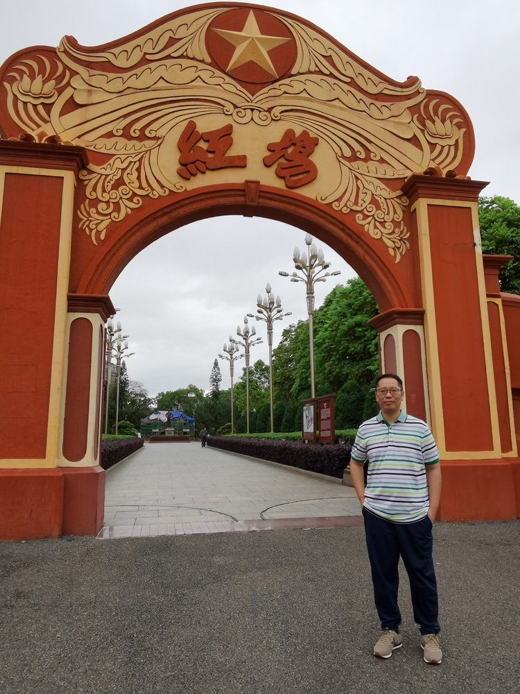

# 黄嘉纶

- 栏目：大数据技术与工程系
- 日期：2026-04-30
- 原文：https://site.gcc.edu.cn/xydw/dsjjsygc/sjkxyfxjys1/a957b9d5880540d88019fd62d3dae3e0.htm
- 照片：
  - 大数据技术与工程系\黄嘉纶.jpg

黄嘉纶，数学与计算机科学学士，数学博士。研究方向为计算群论、机器学习及其在金融风险管理与信贷的应用，曾于银行、互联网大厂，上市头部互联网金融公司任职高级风险经理、风控总监、高级算法专家等岗位。主要从事巴塞尔协议下的银行全面风险管理、风险计量、机器学习与人工智能及其在金融风控、信贷的应用，曾主持多家金融机构巴塞尔全面风险管理、智能风控与信贷相关的多个项目的设计、实施与落地。
