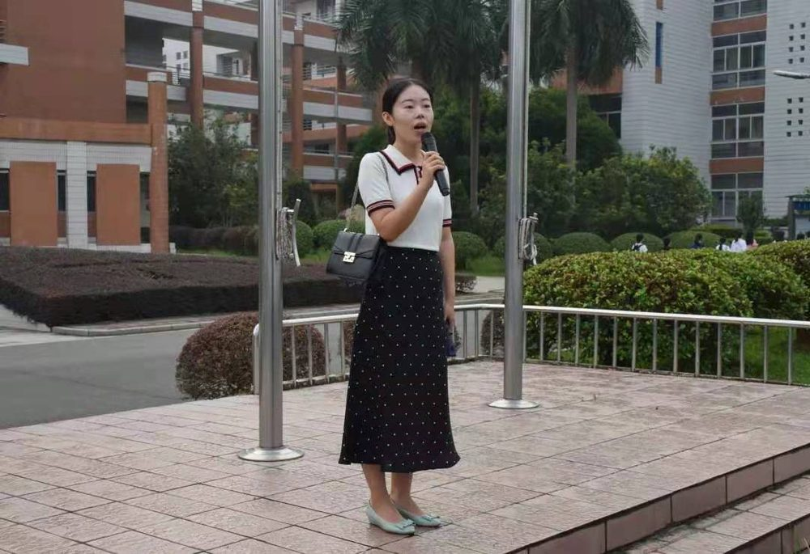

# 廖琪 老师

- 栏目：学生工作办公室
- 日期：2021-01-15
- 原文：https://site.gcc.edu.cn/xydw/xsgzbgs/729ec78cef994feeba863aa67fe31a9d.htm
- 照片：
  - 学生工作办公室\廖琪 老师.jpg

廖琪，女，中共党员，研究生学历，2018年7月参加工作。现任信息技术与工程学院2023级辅导员，分管学生奖助贷工作。曾获广东高校学生工作优秀案例二等奖、三等奖各一项，广东高校思想政治工作优秀论文三等奖两项，校“优秀党务工作者”、“优秀新闻宣传工作者”称号。
