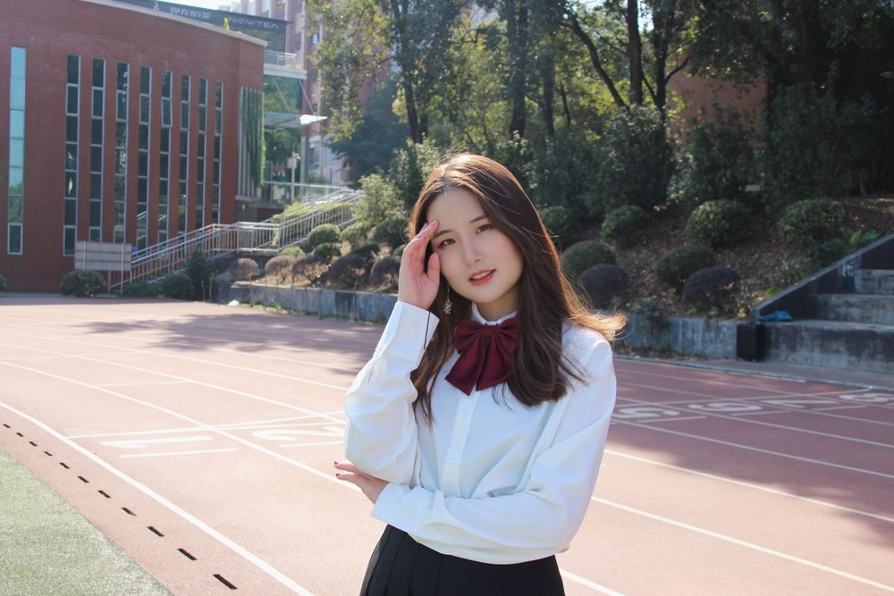

# 胡舒娅 老师

- 栏目：学生工作办公室
- 日期：2021-01-14
- 原文：https://site.gcc.edu.cn/xydw/xsgzbgs/bffea1a1f06b42328b0d898d1f77f5e6.htm
- 照片：
  - 学生工作办公室\胡舒娅 老师.jpg

胡舒娅，女，中共党员，江西上饶人，2020年6月加入中国共产党，2021年2月参加工作，现任广州商学院信息技术与工程学院2025级辅导员，信息技术与工程学院学生会指导老师，团委副书记。
