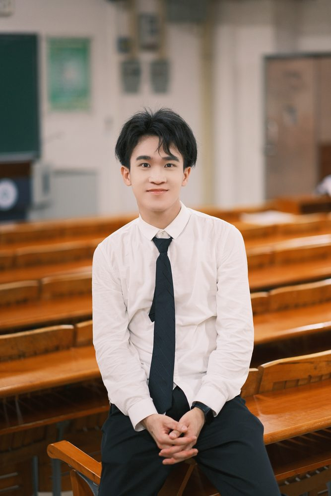

# 黄栩霈老师

- 栏目：学生工作办公室
- 日期：2025-09-07
- 原文：https://site.gcc.edu.cn/xydw/xsgzbgs/640d91e162bc4c90a1377ff4305b3cba.htm
- 照片：
  - 学生工作办公室\黄栩霈老师.jpg

黄栩霈，男，中共党员，毕业于华南农业大学，2024年12月加入中国共产党，2025年9月参加工作，现任信息技术与工程学院2023级辅导员，兼任学院通讯员。
