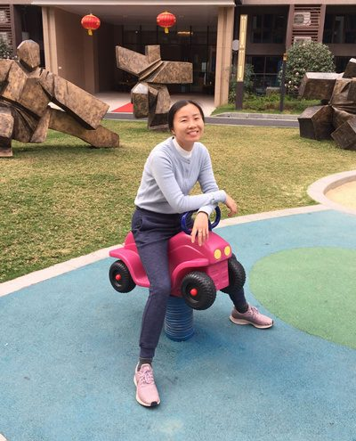

# 徐美霞 老师

- 栏目：学院办公室
- 日期：2010-10-09
- 原文：https://site.gcc.edu.cn/xydw/xybgs4/13e56065556a43d6a4e718d40dc07a51.htm
- 照片：
  - 学院办公室\徐美霞 老师.jpg

徐美霞，女，助理研究员。负责信息技术与工程学院教务员工作。

论文发表情况：
高校教务管理信息化建设现状及对策思考      独立完成 2017年5月 科技经济导刊
云平台下基于RAC技术的教务系统研究与优化 第一作者      2017年7月 现代计算机

获奖情况：
1、2010年度，被学校评为优秀教务员；
2、2011年度，被学院评为优秀教务员；
3、2014年度，被学院评为优秀兼职档案员；
4、2014-2015学年度第一学期，学期绩效考核“优秀”；
5、2015-2016学年度第二学期，学期绩效考核“优秀”；
6、2016-2017学年度第二学期，学期绩效考核“优秀”；
7、2019-2020学年度第一学期，学期绩效考核“优秀”。
