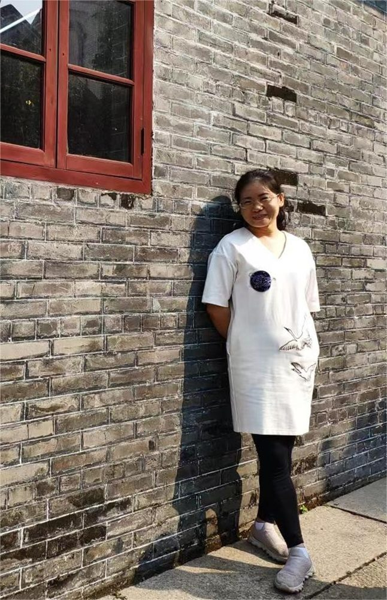

# 李瑜    老师

- 栏目：学院办公室
- 日期：2023-11-29
- 原文：https://site.gcc.edu.cn/xydw/xybgs4/5ebf3e011b1a4db3afd30f8f6b26a682.htm
- 照片：
  - 学院办公室\李瑜    老师.jpg

李瑜，2004年毕业于黄冈师范学院教育技术专业，2011年取得山东科技大学计算机科学与技术专业方向硕士学位，2005年至2011年供职于青岛滨海学院，2011年8月至今担任广州商学院信息技术与工程学院教务员，主要负责学院各年级专业课程的日常教务管理、学生日常成绩问题处理、安排考试等工作。
