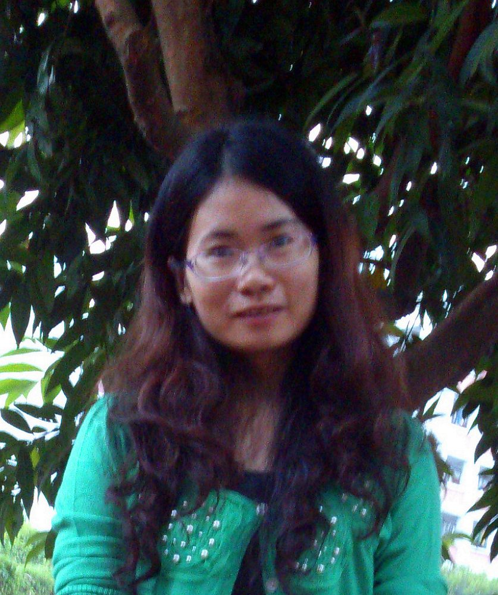

# 李瑜　老师

- 栏目：学院办公室
- 日期：2013-05-08
- 原文：https://site.gcc.edu.cn/xydw/xybgs4/ca19ac0a6b234fdf942b0ee06392a61c.htm
- 照片：
  - 学院办公室\李瑜　老师.jpg

李瑜，女，计算机系教务员。2004年毕业于黄冈师范学院教育技术专业，2011年取得山东科技大学计算机科学与技术专业方向硕士学位，2005年至2011年供职于青岛滨海学院，2011年8月至今在华南师范大学增城学院担任教务员，主要负责计算机系各年级专业课程的日常教务管理、学生日常成绩问题处理、排课、安排考试等工作。
