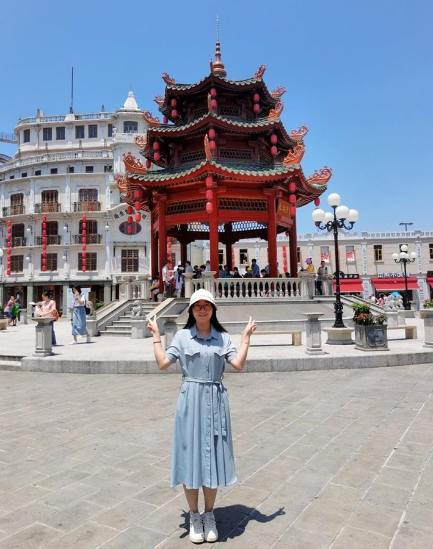

# 龚瑞娟    老师

- 栏目：学院办公室
- 日期：2023-11-29
- 原文：https://site.gcc.edu.cn/xydw/xybgs4/da50e60440d84dd1a0b06f7a070e7f93.htm
- 照片：
  - 学院办公室\龚瑞娟    老师.jpg

龚瑞娟，女，中共党员，广东惠东人，2018年加入中国共产党，2021年参加工作。现任广州商学院信息技术与工程学院教务员，主要负责校企合作、三二分段工作以及实验教学管理工作。

获奖情况：

1.2017年11月获得“精神文明志愿者”称号。

2.2020年7月获得“优秀共产党员”奖项。

3.2022-2023学年第一学期，学期绩效考核“优秀”。

4.2023年4月获得“优秀工会会员”奖项。

5.2023年7月被评为“结对子”工作优秀个人。
