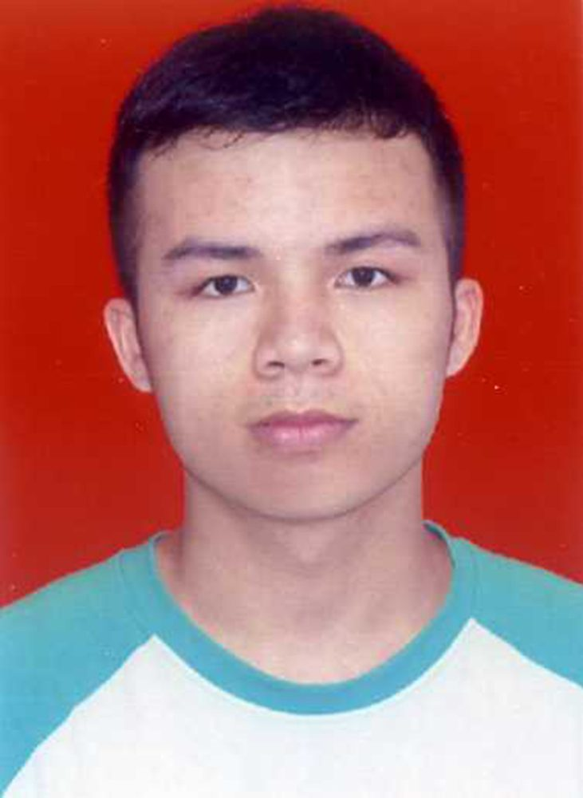

# 实验室人员简介——梁泳辉

- 栏目：实验室办公室
- 日期：2023-10-14
- 原文：https://site.gcc.edu.cn/xydw/sysbgs/b529d7c80f294666a4bbce77b4846020.htm
- 照片：
  - 实验室办公室\实验室人员简介——梁泳辉.jpg

梁泳辉，男，广东肇庆人，1998年出生，信息技术与工程学院实验员。2019.9-2022.6学生期间担任多媒体课室管理实习生，负责协助上课设备维护，解决上课期间设备突发问题，保障教学任务的顺利开展；2022.8至今，信息技术与工程学院实验员，负责实验室机房管理、机房建设、实验室安全管理、协助老师上课等工作。热爱工作方面：计算机网络技术、计算机应用、操作系统。
