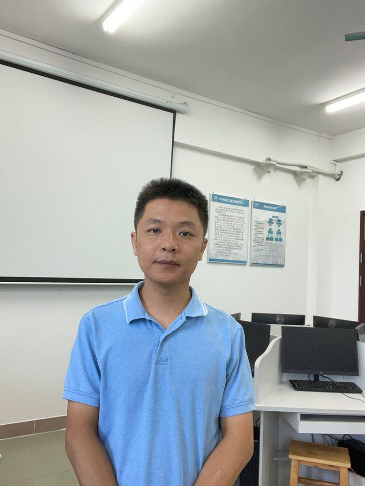

# 实验室人员简介——梁盛

- 栏目：实验室办公室
- 日期：2023-10-14
- 原文：https://site.gcc.edu.cn/xydw/sysbgs/78c5e253b86f4619a8d0b7d9a148b5cf.htm
- 照片：
  - 实验室办公室\实验室人员简介——梁盛.jpg

梁盛，男，实验师，网络工程师，信息系统项目管理师。负责嵌入式系统应用实验室、单片机设计实验室、网络工程实验室等实验室的建设、管理与维护。先后在期刊上发表过论文《交通灯控制实验的改进》、《浅谈高校嵌入式实验室的管理》、《虚拟机VMware在网络实验教学中的应用》、《计算机网络实验教学中VLAN实验的设计研究》。
