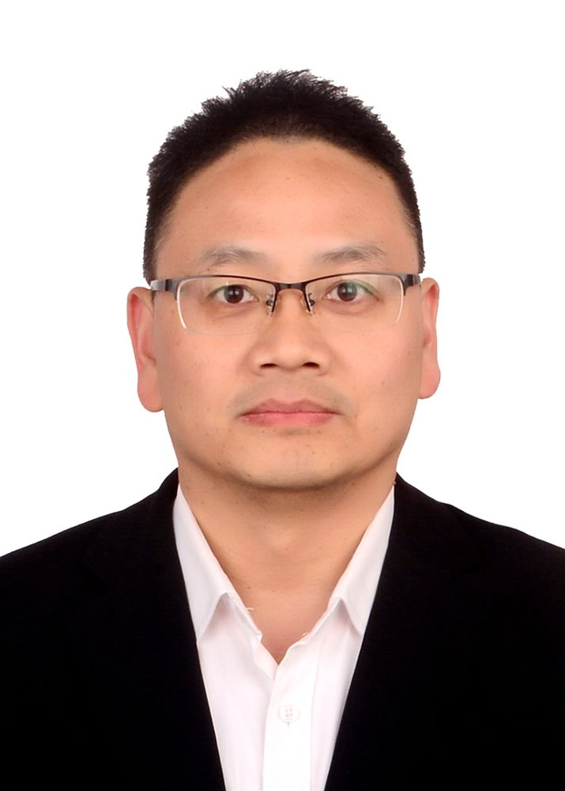

# 刘国福

- 栏目：教学名师
- 日期：2026-05-06
- 原文：https://site.gcc.edu.cn/xydw/jxms/5457d0001ff54d9fb83fa131d76d2803.htm
- 照片：
  - 教学名师\刘国福.jpg

刘国福，博士，正高级工程师，硕士生导师，英国兰卡斯特大学访问学者，本硕毕业于西安交通大学。主要研究领域为精确感知技术。主持/参与国家自然科学基金项目在内的省部级以上项目10余项，发表论文60余篇，其中SCI/EI收录25篇，授权发明专利10项，获发明创业奖创新奖二等奖1次，获省优秀硕士论文指导教师奖1次。主持/参与教学研究项目6项，编著教材6本，获军队教学育才奖银奖1次，获校教学一等奖1次，校教学二等奖1次。立三等功1次。
