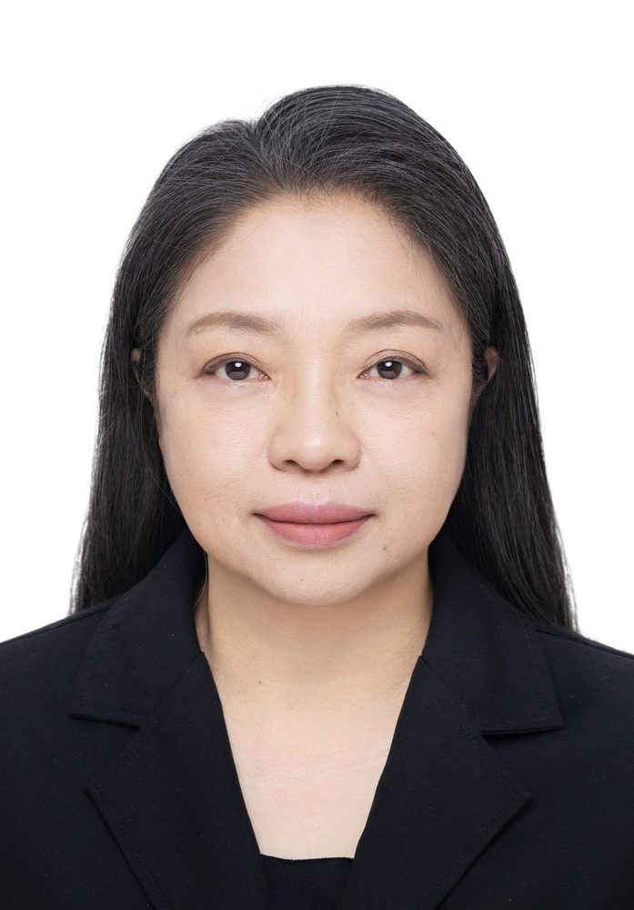

# 李蓉

- 栏目：教学名师
- 日期：2026-05-06
- 原文：https://site.gcc.edu.cn/xydw/jxms/f5f00777e1e6436fb0e924d42f7ac645.htm
- 照片：
  - 教学名师\李蓉.jpg

李蓉，教授。1998年毕业于东北大学计算机及应用专业，现任信息技术与工程学院计算机基础教研室主任。主要研究方向涵盖数据安全、隐私保护、图像处理、模式识别及深度学习技术应用。在教学与科研工作中，李蓉教授秉持“以技术创新驱动教育，以工程实践培育人才”的理念，积极推进计算机基础教育改革。近年来，发表高质量论文20余篇（含SCI论文3篇），主持或参与省级科研项目8项及校级课题10余项。其教学成果显著，曾获校级教学成果奖一等奖1项、二等奖1项，以及省计算机学会教学成果三等奖2项。此外，注重产学研融合，多次指导学生斩获国家级计算机设计大赛奖项，是一位兼具深厚学术造诣与卓越教学能力的骨干教师。
