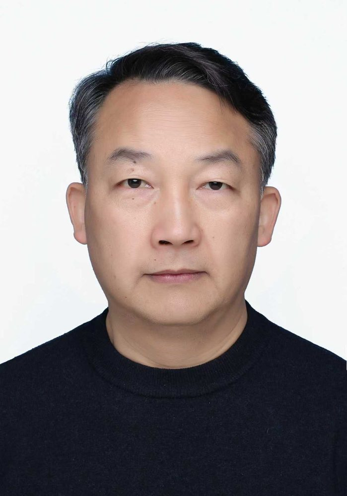

# 杨强

- 栏目：教学名师
- 日期：2026-05-06
- 原文：https://site.gcc.edu.cn/xydw/jxms/4d7a18efeed74a818143489bdeb94165.htm
- 照片：
  - 教学名师\杨强.jpg

杨强，博士、副教授、研究生导师，现任信息技术与工程学院院长，主要研究方向涵盖大数据、人工智能、信息综合处理与辅助决策领域，系军中优秀中青年专家。曾任企业总经理及多校研究生导师。主持国家和军队科研项目20余项，获得国家科学技术进步奖二等奖1项，发表高水平论文60余篇，授权发明专利3项，，荣立个人三等功及优秀党员等多项荣誉。
