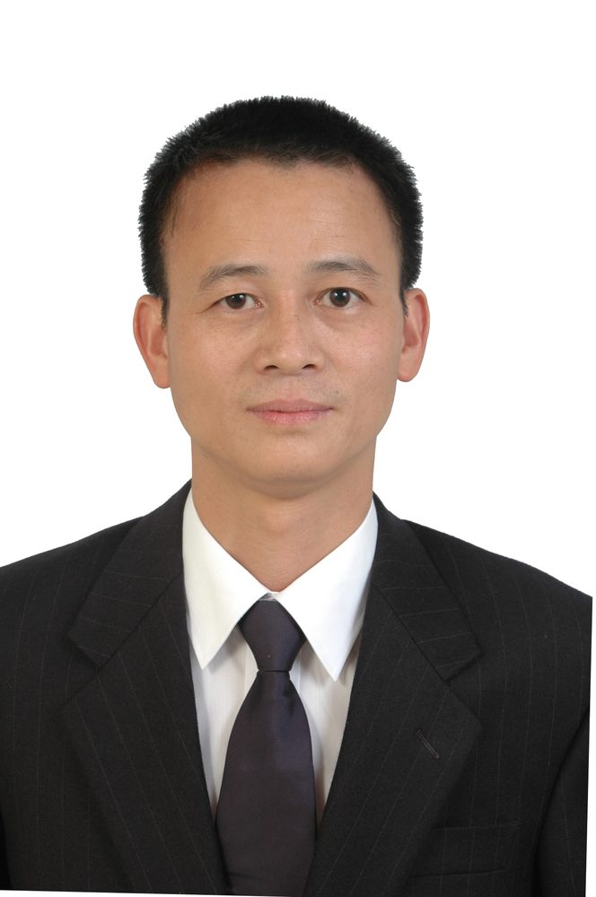

# 邱明辉

- 栏目：教学名师
- 日期：2026-05-06
- 原文：https://site.gcc.edu.cn/xydw/jxms/d38f42f1d08e4ac9ac785c878bc66ac2.htm
- 照片：
  - 教学名师\邱明辉.jpg

邱明辉，博士，教授，广东省计算机学会理事、广东省农村科技特派员，主要从事信息查询、用户体验、信息资源开发与利用等方面研究，曾主持或参与国家、部、省级科研项目15项，出版著作3部，发表学术论文50多篇，其中被人大复印报刊资料全文转载7篇，个人获得军队、海军级奖励8项，指导学生获得省级以上奖励10余项。
