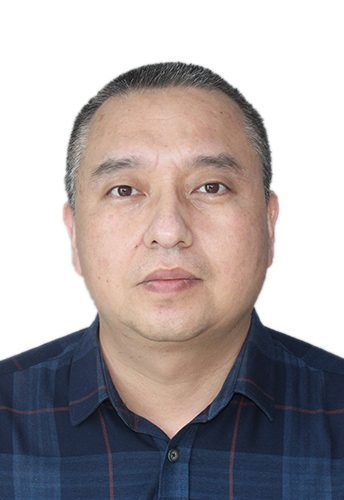

# 韩来权

- 栏目：教学名师
- 日期：2026-05-06
- 原文：https://site.gcc.edu.cn/xydw/jxms/ec2887af73f34f0991d487bd2800c9be.htm
- 照片：
  - 教学名师\韩来权.jpg

韩来权，博士，教授，硕士生导师。1977年生，本科、硕士、博士、博士后均毕业于东北大学。主要从事智慧心理、未来网络、云计算、深度学习、物联网等方向的科研和人才培养工作。曾在东北大学任教23年，在企业从事博士后研究工作2年。获得省科技进步奖、省教学成果奖各1项。发表学术论文40余篇；专利10余项，横纵向课题50余个；教师竞赛获奖10余项；获国家级、省级学科竞赛奖20余项。是CCF互联网专委、计算机学会会员、全国职业技能竞赛网络赛道裁判。
