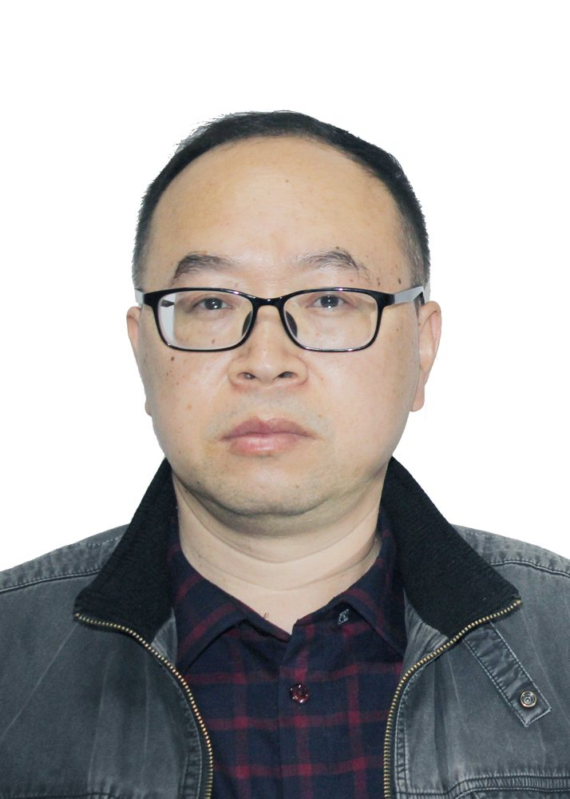

# 黄世奇

- 栏目：教学名师
- 日期：2026-05-06
- 原文：https://site.gcc.edu.cn/xydw/jxms/ca21de921239429d8a693a28f7a95213.htm
- 照片：
  - 教学名师\黄世奇.jpg

现为广州商学院老师，人工智能学科负责人。研究方向：图像处理、模式识别、人工智能。发表论文180余篇，SCI收录30多篇，EI收录70多篇；学术专著4部。授权国防发明专利2项、国家发明专利15项，主持项目18项，获各种奖项30余项。获陕西省第九届青年科技奖荣誉称号。兼任广东省大数据专业委员会委员、广东省人工智能协会专家、广东省计算机学会理事、国家自然科学基金委通讯评审专家等。
