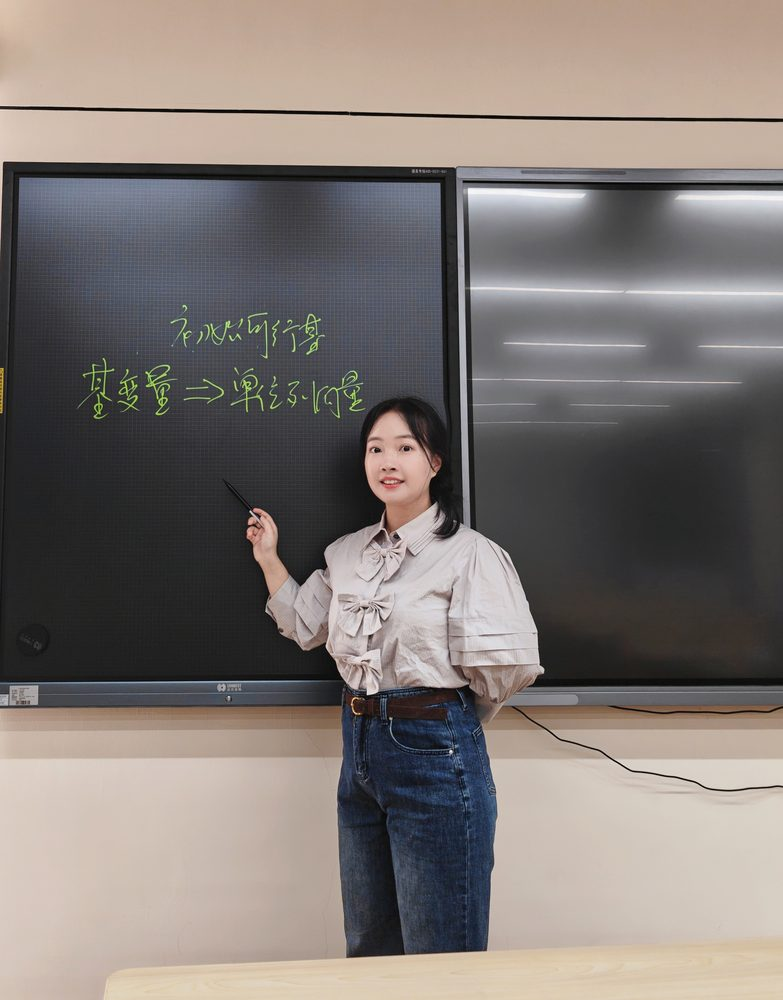

# 刘烨

- 栏目：数字媒体与创意工程教研室
- 日期：2026-05-06
- 原文：https://site.gcc.edu.cn/xydw/wlkjaqyszmt/szmtycygcjys1/d78be3e71daf41229b84cfcf4fcb4838.htm
- 照片：
  - 数字媒体与创意工程教研室\刘烨.jpg

刘烨，硕士研究生。2021年7月于广州大学获得硕士学历学位证书，2022年9月起在广州商学院担任专任教师，教授课程《高等数学》，《线性代数》，《微积分》，《经济数学》等，目前为止有2次学生评价在前5%，5次在前30%。2023年11月作为第一作者在SCI一区期刊《JOURNAL OF ENVIRONMENTAL CHEMICAL ENGINEERING》发表了论文Highly effective removal of thallium(l) by nanostructured titanium pyrophosphate from acidic wastewater。
