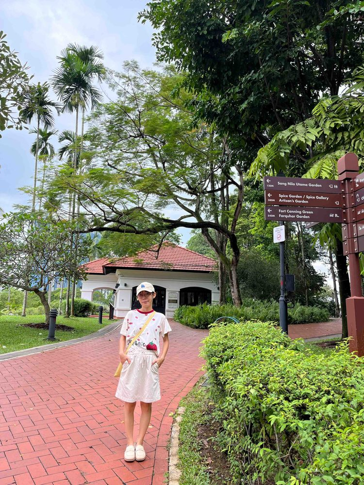

# 吕思颖

- 栏目：数字媒体与创意工程教研室
- 日期：2026-05-06
- 原文：https://site.gcc.edu.cn/xydw/wlkjaqyszmt/szmtycygcjys1/f56aed30a442495ab290e407e3cdc16e.htm
- 照片：
  - 数字媒体与创意工程教研室\吕思颖.jpg

吕思颖，硕士研究生，本科与硕士均毕业于广西大学，长期深耕电气工程以及基础数学领域，具备深厚的工科理论基础与跨学科教学素养。参与校级科研项目1项，横向科研项目1项，以第一作者在国内外期刊发表学术论文5篇，其中3篇核心期刊。

教学上，坚持“立德树人”与技术实践并重，主讲《经济数学》《高等数学》《模拟与数字电路》等核心课程，深受学生好评。愿以赤诚之心，培育兼具创新力与工程素养的新时代人才。
