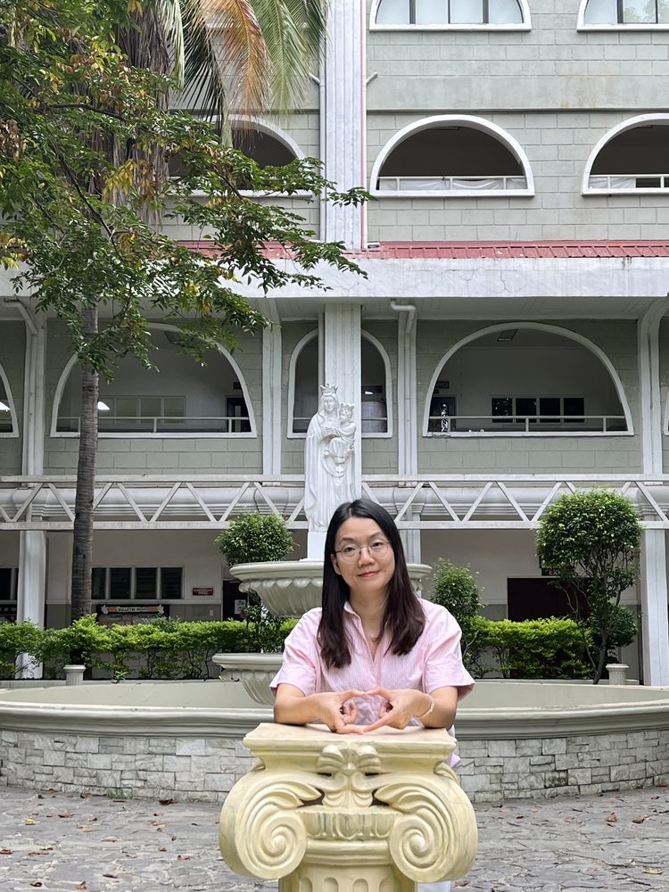

# 宁晓虹

- 栏目：数字媒体与创意工程教研室
- 日期：2026-05-06
- 原文：https://site.gcc.edu.cn/xydw/wlkjaqyszmt/szmtycygcjys1/83f1f84b657a4d398597b21badc9a12e.htm
- 照片：
  - 数字媒体与创意工程教研室\宁晓虹.jpg

宁晓虹，女，中共党员，副教授，博士。广州商学院信息技术与工程学院专任教师。曾任信息技术与工程学院教工党支部书记，华为ICT学院办公室主任。个人主持及参与校级以上项目6项，公开发表论文、著作等近20项。多次获“优秀党务工作者”、“优秀共产党员”、“新闻宣传工作先进个人”等荣誉；曾获广州商学院“优秀管理工作奖”、“教育园优秀教职工三等奖”、“广州商学院第一届课堂教学比赛一等奖”等奖项。
