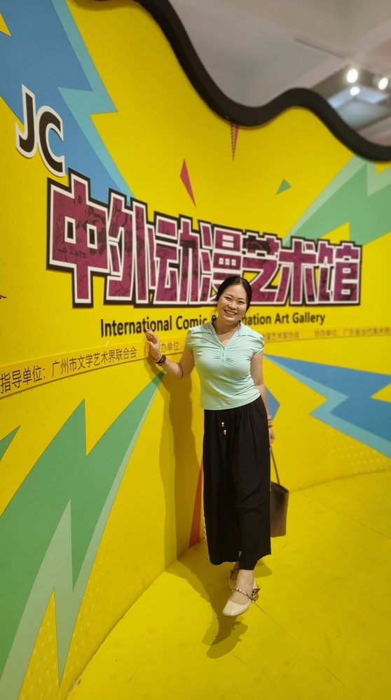

# 庄志蕾

- 栏目：数字媒体与创意工程教研室
- 日期：2026-05-06
- 原文：https://site.gcc.edu.cn/xydw/wlkjaqyszmt/szmtycygcjys1/88cbe0255a5e453189dbece0b7534890.htm
- 照片：
  - 数字媒体与创意工程教研室\庄志蕾.jpg

庄志蕾，女，硕士，广州商学院信息技术与工程学院任专任教师，现任数字媒体与创意工程教研室主任。2014年-2022年兼任广东省高等学校大学计算机课程考试命题委员会Photoshop组命题委员。

主要负责《计算机应用基础》、《计算机图像处理基础基础（Photoshop）》、《数据库技术原理》、《Python程序设计》、《人工智能通识基础》等多门课程的教学工作。曾参与编写多部教材，任主编的PS系列教材受到多所高校订购，发行量达三万余册。大学生计算机设计大赛广商校内负责人之一，多次组织学生参加计算机设计大赛并获得奖项。

在教学中注重因材施教，激发学生学习积极性，两次次获得教学成果奖。
