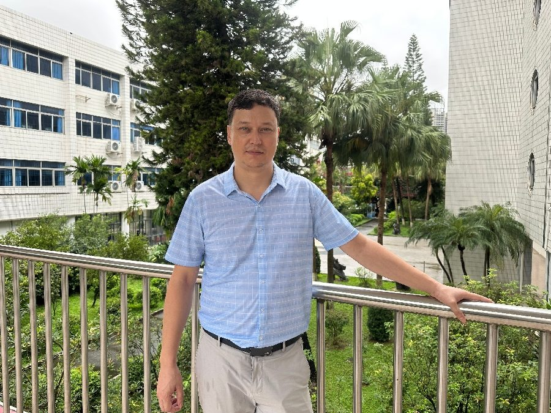

# 肉孜买买提•马合木提

- 栏目：数学基础教研室
- 日期：2026-05-08
- 原文：https://site.gcc.edu.cn/xydw/sxjcjys1/2c61e36d406e4b66a6167aec1242020d.htm
- 照片：
  - 数学基础教研室\肉孜买买提•马合木提.jpg

肉孜买买提•马合木提博士毕业于日本大阪大学基础工学研究科，并曾在该校从事博士后研究工作。研究领域涵盖计算数学、数理医学及神经网络稳定性分析。长期与日本大阪大学、法国波尔多大学等知名高校的研究机构保持科研合作。已在国内外期刊上发表论文20余篇，主持过两项科研项目。
