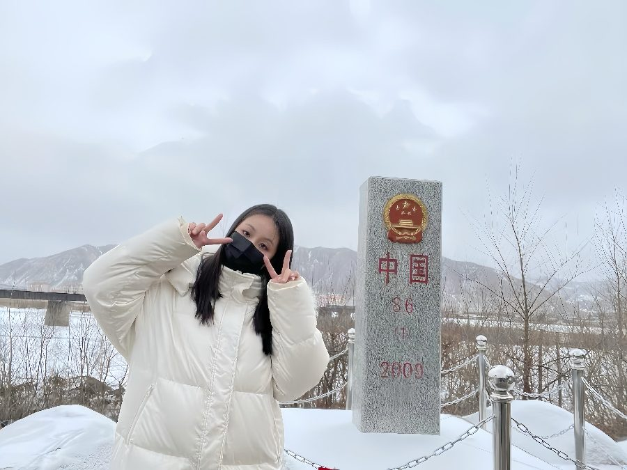

# 苏晴

- 栏目：数学基础教研室
- 日期：2026-05-08
- 原文：https://site.gcc.edu.cn/xydw/sxjcjys1/d8086851bdb4433b9266772737791ffc.htm
- 照片：
  - 数学基础教研室\苏晴.jpg

苏晴，女，中共党员，讲师。2022年进入广州商学院担任专任教师，主要从事数学类课程的教学与科研工作。主讲《高等数学》、《经济数学》、《数学建模》等本科课程。作为指导老师，曾多次带领学生在“全国大学生数学建模竞赛”、“全国大学生数学竞赛”等赛事中荣获省级及以上奖项，累计指导学生获奖十余项。在科研方面，研究方向涵盖混料试验设计与数学建模应用，已发表多篇学术论文。曾获校优秀教学奖、毕业论文优秀指导教师等荣誉。
