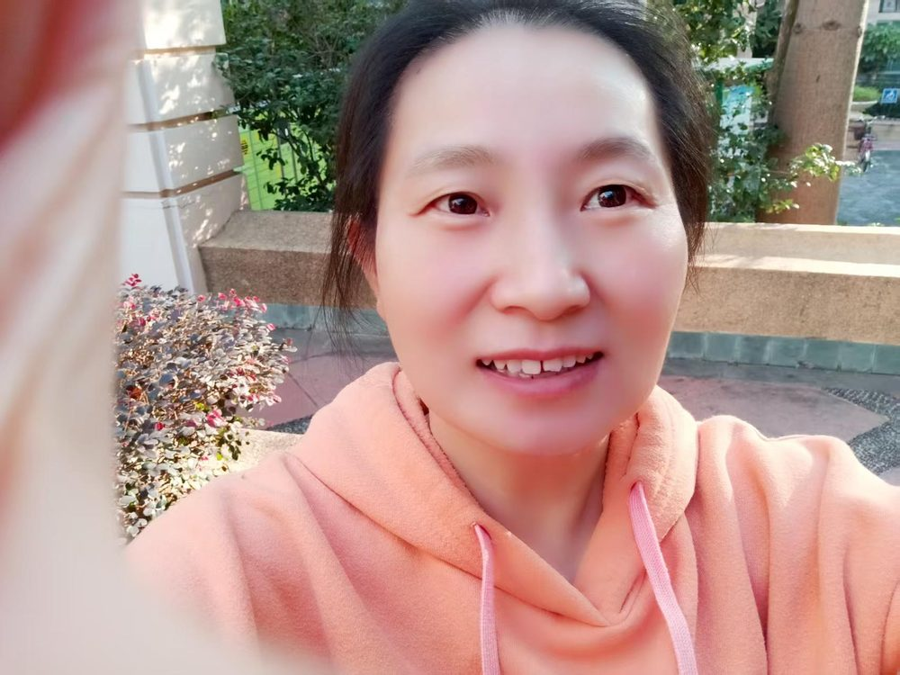

# 赵旭芳

- 栏目：数学基础教研室
- 日期：2026-05-08
- 原文：https://site.gcc.edu.cn/xydw/sxjcjys1/f2b53e2128d9463c938161e860dc9ee8.htm
- 照片：
  - 数学基础教研室\赵旭芳.jpg

赵旭芳，女，研究生学历，理学硕士，副教授。主要讲授课程《经济数学》、《高等数学》、《统计学》、《数学建模基础》。多次指导学生在“全国大学生数学建模竞赛”、“全国大学生数学竞赛”等赛事中荣获省级及以上奖项，累计获奖二十余项。研究方向应用数学，已发表多篇学术论文，主持与参与多个省级与校级教研项目。曾获省级优秀指导教师奖、校级优秀教学奖、优秀教风先进个人、学期绩效优秀等荣誉。
