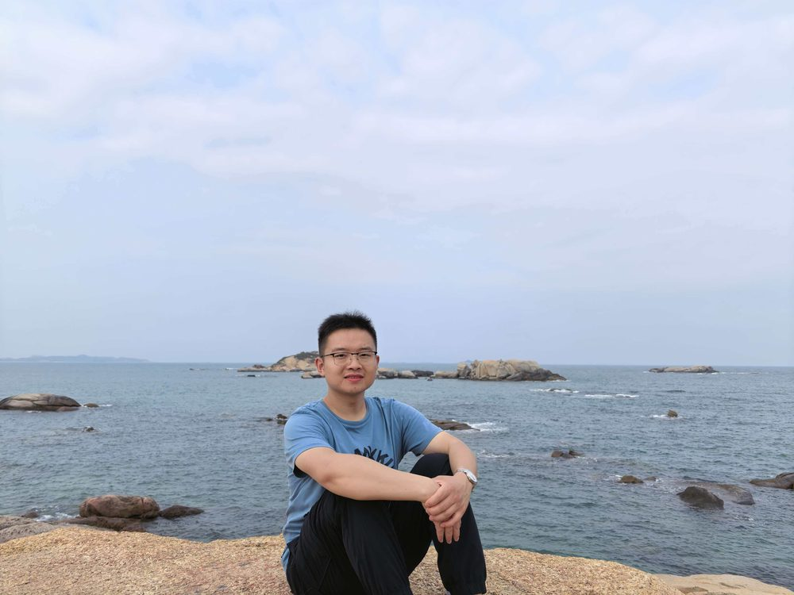

# 杨禹锟

- 栏目：智能科学与人工智能教研室
- 日期：2026-04-30
- 原文：https://site.gcc.edu.cn/xydw/rgzn/znkxyrgznjys1/7247bb2c8bcd4e3db03c373385303e52.htm
- 照片：
  - 智能科学与人工智能教研室\杨禹锟.jpg

杨禹锟，博士。研究方向为计算机视觉、深度学习及多传感器融合等。本科毕业于华南农业大学农业机械化及其自动化专业，硕士毕业于石河子大学农业工程专业，博士毕业于吉林大学农业机械化工程专业。参与国家级项目3项，以第一作者发表SCI论文5篇、EI论文1篇，授权国家发明专利10余项。
