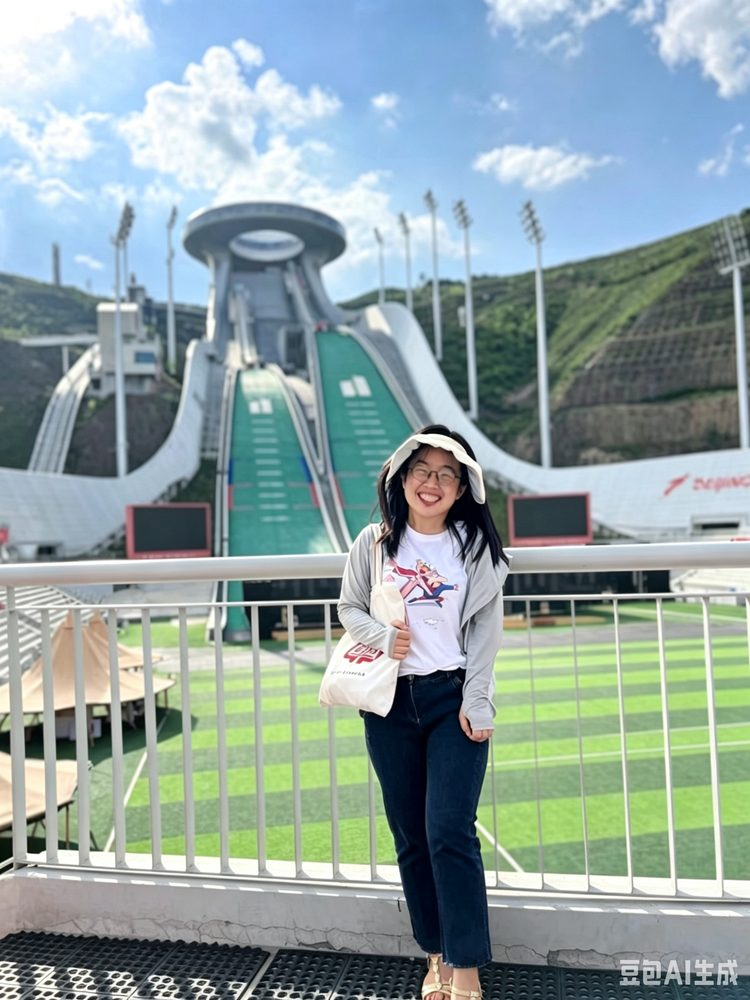

# 王跃文

- 栏目：智能科学与人工智能教研室
- 日期：2026-04-30
- 原文：https://site.gcc.edu.cn/xydw/rgzn/znkxyrgznjys1/171e761282e14f6fb1abf650110ce351.htm
- 照片：
  - 智能科学与人工智能教研室\王跃文.jpg

王跃文，女，讲师，“双师双能”型教师。毕业于华南农业大学，硕士研究生学历，主要研究方向为农业智能装备。拥有近十年教龄，始终秉持“教书育人、以生为本”的教育理念，坚守教学一线，关爱学生成长。在专业发展方面，她不断锤炼自身技术能力，利用寒暑假深入企业实践学习，持续提升专业技术水平和科研能力，实现了教学与工程实践的双向赋能与协同进步。
