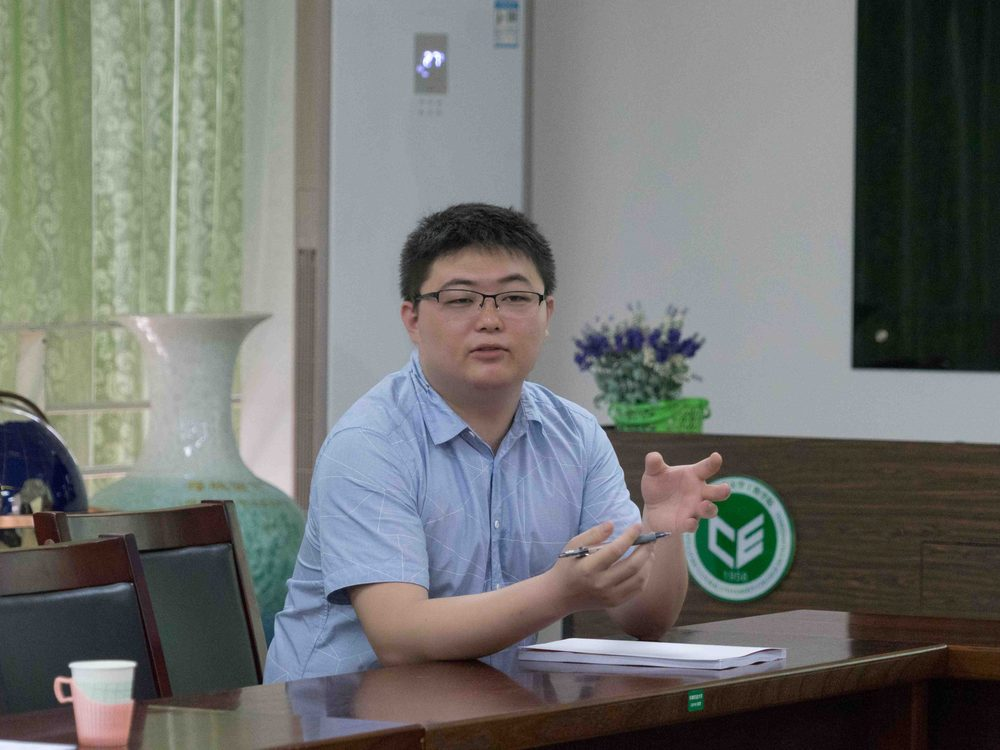

# 臧禹

- 栏目：智能科学与人工智能教研室
- 日期：2026-04-30
- 原文：https://site.gcc.edu.cn/xydw/rgzn/znkxyrgznjys1/900f85422b5a47dbb8dd4d363a777d0b.htm
- 照片：
  - 智能科学与人工智能教研室\臧禹.jpg

臧禹，副教授，工学博士，智能科学与技术教研室教师，广州商学院低空经济智创团队负责人。主要从事农用无人机智能化作业技术与无人机遥感技术研究。2019年博士毕业于华南农业大学农业机械化工程专业，后在华南农业大学从事博士后研究。近年来发表SCI论文7篇、EI论文3篇，获授权发明专利5项；主持广东省自然科学基金、广东高校重点建设学科科研能力提升项目等课题，参与国家自然科学基金、国家重点研发计划等项目20余项。兼任中国农业机械学会农业航空分会委员、副秘书长。主讲机器学习、深度学习等课程，指导学生获广东省“挑战杯”、“攀登计划”等成果，多次获最受学生喜爱教师、优秀教学奖等荣誉。
