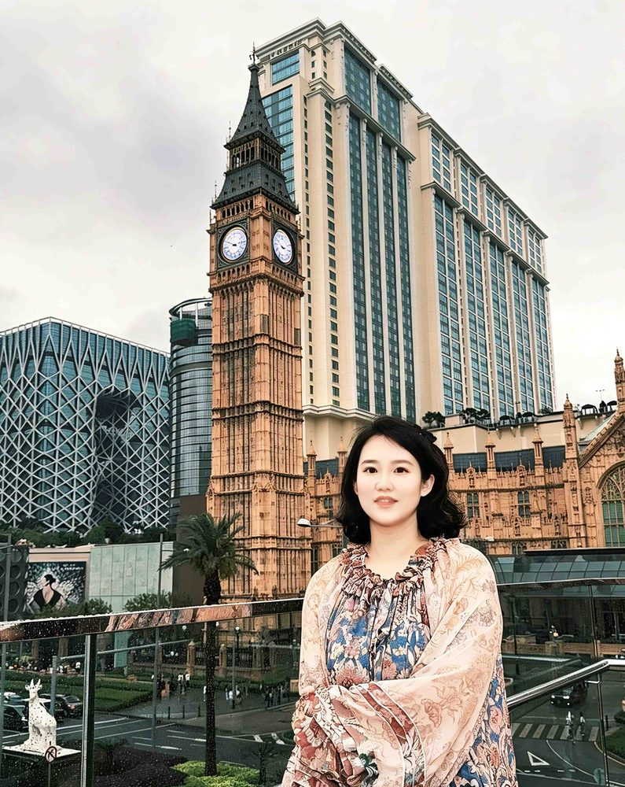

# 薛含笑

- 栏目：智能科学与人工智能教研室
- 日期：2026-04-30
- 原文：https://site.gcc.edu.cn/xydw/rgzn/znkxyrgznjys1/306081b09eaf48c4bc73ea83afea1d01.htm
- 照片：
  - 智能科学与人工智能教研室\薛含笑.jpg

薛含笑，硕士研究生，高级工程师，毕业于广州大学，曾公派访问澳大利亚斯威本科技大学。研究领域为人工智能与机器学习算法。教学方面，荣获广东省高等学校教学管理学会2025年度教学质量管理与评价改革优秀案例评选优秀奖、广州商学院2025年教师节评选活动优秀教学奖、2025年学风建设月系列之“优秀教风”评选活动优秀教风先进个人，以及广州商学院第7届中青年教师教学大赛决赛三等奖。科研成果包括发表中文核心及SCI论文4篇、普通期刊论文若干，参与多项横向项目，主持校级项目1项。
