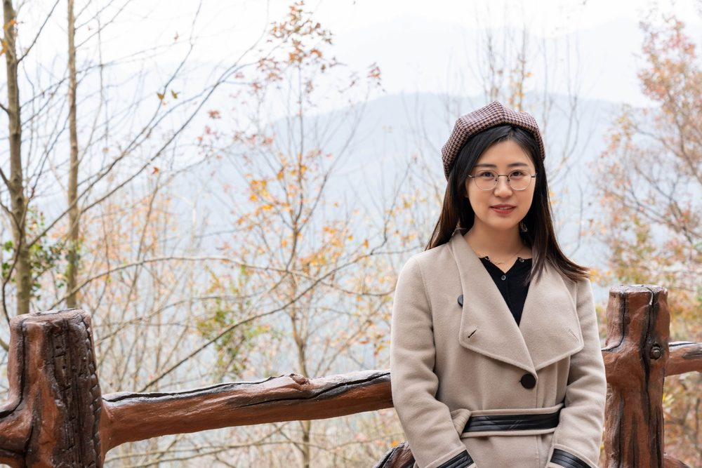

# 谷秀艳

- 栏目：智能科学与人工智能教研室
- 日期：2026-04-30
- 原文：https://site.gcc.edu.cn/xydw/rgzn/znkxyrgznjys1/795682fdda724e74bf5d9750f950bf36.htm
- 照片：
  - 智能科学与人工智能教研室\谷秀艳.jpg

谷秀艳，硕士，讲师，2017年毕业于华南农业大学工程学院，获计算机技术与软件专业技术资格“高级信息系统项目管理师”。主要承担《机器学习》《Python程序设计》《概率论与数理统计》《微积分》等课程教学，学生评教排名前30%，曾获“学生最喜爱教师奖”“优秀教学奖”。研究方向为智慧农业，主持青年创新人才项目“植保无人机仿地定高飞行关键技术算法研究与示范应用”及1项省级横向项目，均已按期结题；参与省市级、校级科研及学科建设项目十余项，发表论文十余篇。现为低空经济智创团队负责人之一，指导学生参加“攀登计划”“大创”“挑战杯”等竞赛并获省级奖项。
