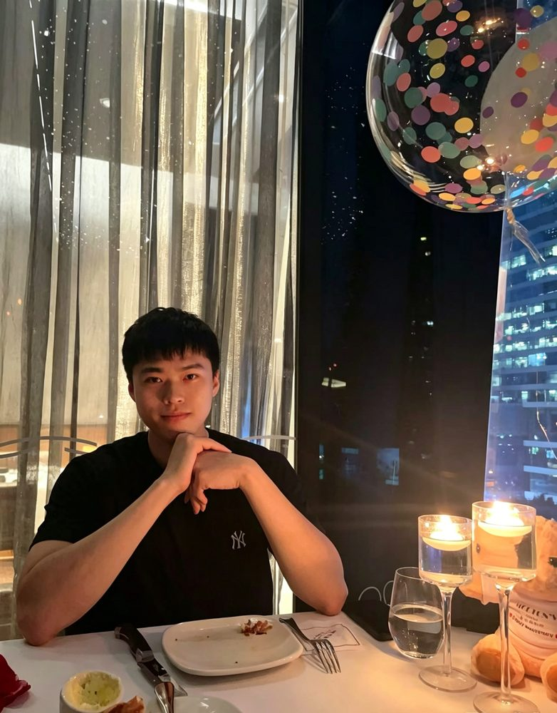

# 黄曦朗

- 栏目：智能科学与人工智能教研室
- 日期：2026-04-30
- 原文：https://site.gcc.edu.cn/xydw/rgzn/znkxyrgznjys1/3bd493366f0a4e3ab23a65d81d3f2c90.htm
- 照片：
  - 智能科学与人工智能教研室\黄曦朗.jpg

黄曦朗，工学博士，毕业于韩国釜庆大学，2022—2025 年于韩国梨花女子大学从事博士后研究，现任广州商学院信息工程与技术学院专任教师。主要研究方向为小样本学习、图神经网络、多模态信息融合与开放集识别等人工智能前沿领域。主讲《大模型原理与实践》《强化学习及其应用》等专业课程，注重结合案例实操、代码训练与项目实践。累计发表高水平学术论文 7 篇，其中一区 Top 论文 3 篇。
