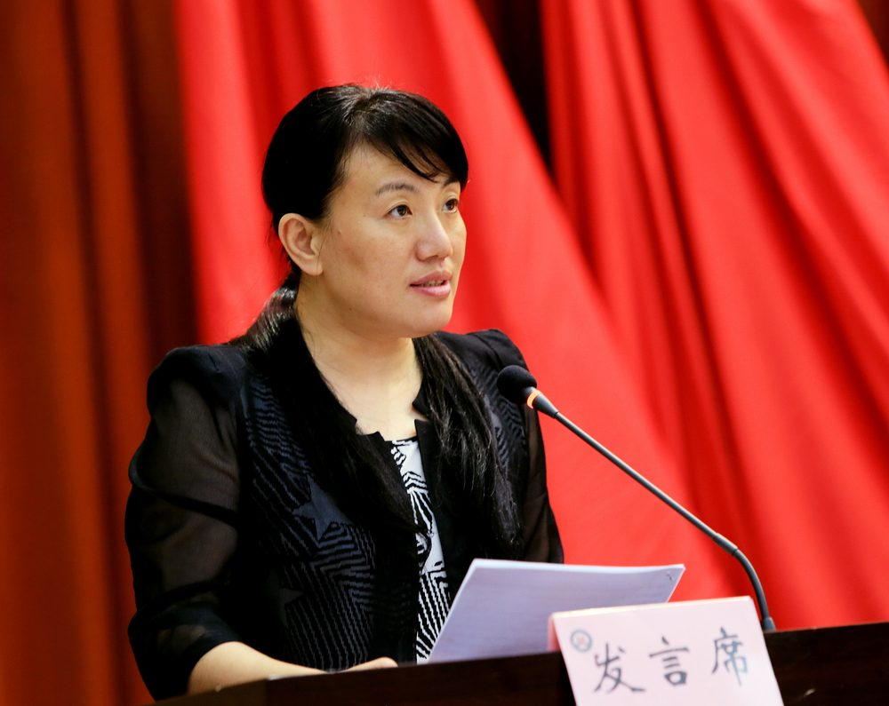

# 余华

- 栏目：智能软件应用教研室
- 日期：2026-04-28
- 原文：https://site.gcc.edu.cn/xydw/rjgc/znrjyyjys1/2680d2480ce84f1dadac0b428f3da874.htm
- 照片：
  - 智能软件应用教研室\余华.jpg

余华，教授，工学博士，共产党员，硕士研究生指导教师，广东省计算机学会大数据专业委员会委员，湖北省自动化学会理事，武汉市自动化学会理事，中国武汉（南方十一省）电工理论学会理事。研究方向：大数据与云计算、人工智能等。本科毕业于国防科学技术大学，硕士、博士毕业于海军工程大学。多次荣获国家级教学技能竞赛二等奖，主持纵向和横向项目20余项，发表学术论文123篇，授权国家实用新型专利35项。
