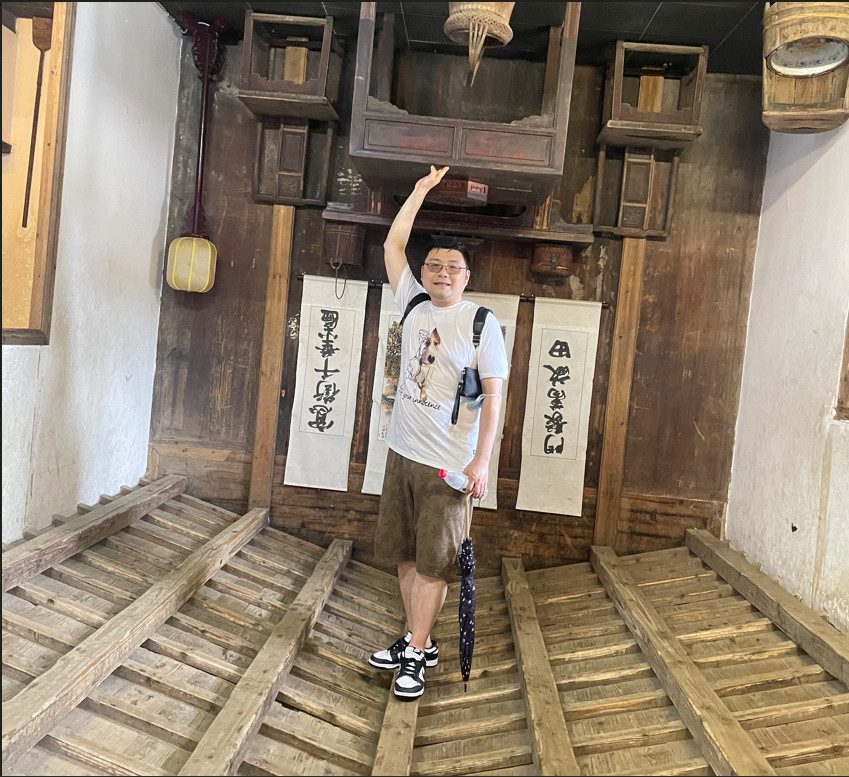

# 杨佳辉

- 栏目：智能软件应用教研室
- 日期：2026-04-28
- 原文：https://site.gcc.edu.cn/xydw/rjgc/znrjyyjys1/31f3e7d42eec4b7c86d145eff078f215.htm
- 照片：
  - 智能软件应用教研室\杨佳辉.jpg

杨佳辉，男，软件工程硕士，高级工程师。先后在公安部第三系统研究所北京锐安科技股份有限公司、航天科工706所航天中认科技(北京)责任有限公司、武汉格蓝若智能技术责任有限公司等企业工作十余年。先后主持参与6个省部级项目，发表发明专利1项。2025年7月入职广州商学院，现任信息技术与工程学院软件工程专业教师。为人诚恳、乐观向上；工作积极认真、细心负责，立志做一名优秀的人民教师。
