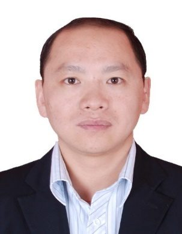

# 邹锋

- 栏目：智能软件应用教研室
- 日期：2026-04-28
- 原文：https://site.gcc.edu.cn/xydw/rjgc/znrjyyjys1/33e6fed4628e428a9f864ec52bdd69bb.htm
- 照片：
  - 智能软件应用教研室\邹锋.jpg

邹锋，博士，副教授，考评员，校级骨干教师，双师双能型教师。长期从事数据挖掘与机器学习领域的理论与应用研究，现任大模型智能应用研究团队负责人。近年来主持及参与省级、校级科研与教改项目10余项；以第一作者在国内外核心学术期刊及EI会议发表论文20余篇；主持及参与实用新型发明专利2项；主编出版专业教材2部。坚持教研相长，深耕大数据前沿技术攻关与产教融合实践，多次荣获校级“优秀教师”及“教学优秀奖”。
