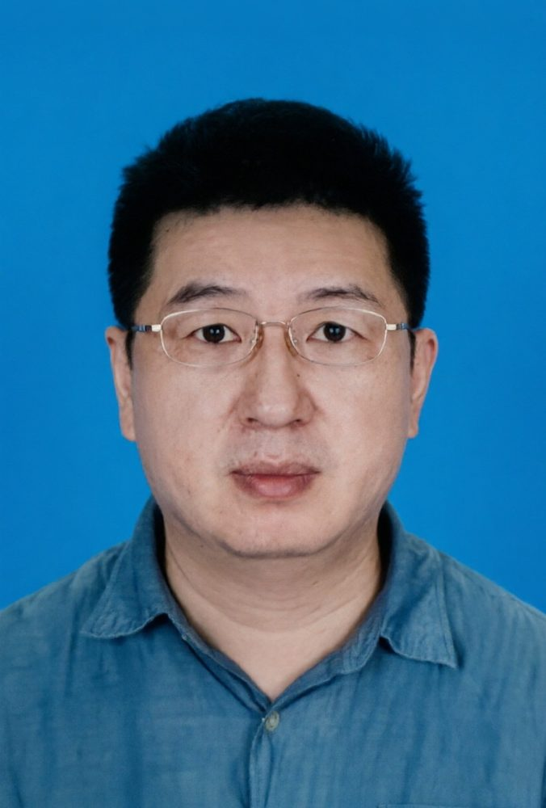

# 魏湘辉

- 栏目：智能软件应用教研室
- 日期：2026-04-28
- 原文：https://site.gcc.edu.cn/xydw/rjgc/znrjyyjys1/8e0fd50fbf8e4a0eae5df6a7488c6aba.htm
- 照片：
  - 智能软件应用教研室\魏湘辉.jpg

魏湘辉，博士。2009年4月毕业于早稻田大学情报生产系统研究科，获博士学位。曾获早稻田大学“大川功情报通信奖”（2007年），并受日本学术振兴会资助担任Global COE高级研究助手（2008-2009年）。科研成果丰硕：参与国际标准H.265提案4项，获专利2项；发表国际会议论文8篇、SCI期刊论文2篇、核心期刊论文2篇
