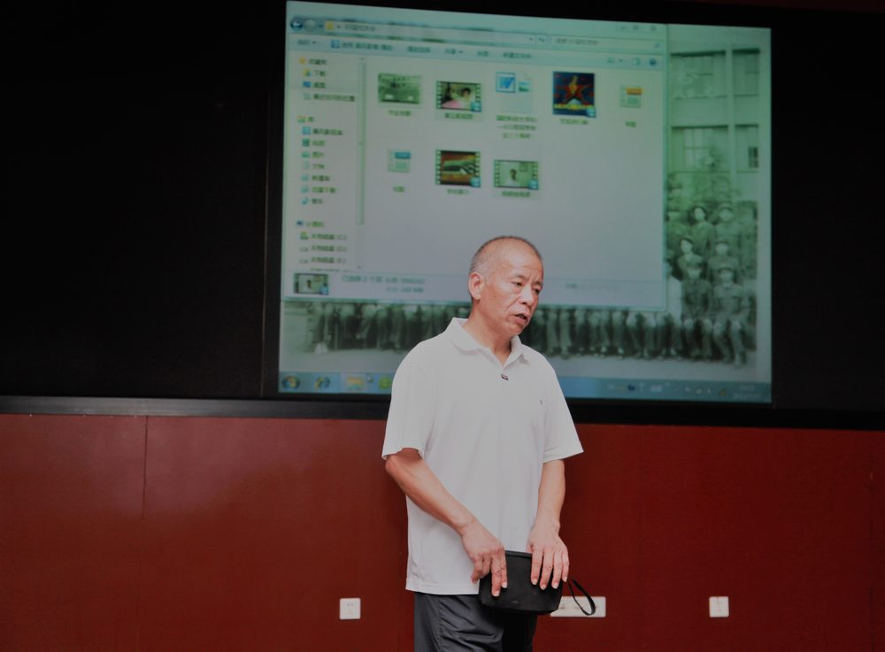

# 何选森

- 栏目：机器视觉与智能感知教研室
- 日期：2026-04-29
- 原文：https://site.gcc.edu.cn/xydw/rgzn/jqsjyzngzjys1/ef0cf585081f437fa8bfc022639a5271.htm
- 照片：
  - 机器视觉与智能感知教研室\何选森.jpg

何选森，男，1958年5月出生。研究生学历，工学硕士，立三等功一次

主持承担由国务院学位委员会办公室、国家教育委员会研究生工作办公室发布的“七五”研究生教育和学位制度研究项目：理工科研究生政治素质与思维能力培养的研究。经验收合格，颁发项目研究证书。

获得国防科工委科技进步奖二等奖一项，获得军队级科技进步三等奖一项，荣获学校“优秀科研奖”两次，科研促进教学优秀案例二等奖，荣获广东省计算机学会优秀论文三等奖三次。

荣获广州商学院教师节“优秀教学奖”两次。获得“优秀指导教师”五次、荣获“蓝桥杯”、“互联网+”大赛优秀指导教师。

科研获奖：

1990年5月——1992年6月主持承担由国务院学位委员会办公室、国家教育委员会研究生工作办公室发布的“七五”研究生教育和学位制度研究项目：理工科研究生政治素质与思维能力培养的研究。经验收合格，颁发项目研究证书。

1995年11月获得国防科工委科技进步奖二等奖一项：新型数据压缩软件——WHH，获奖排名：第一名。

1999年10月获得军队级科技进步三等奖一项：攻防体系对抗中C3I系统对抗的建模及仿真实现，项目排名：第一名。

2019年9月荣获广州华夏职业学院2018-2019学年“优秀科研奖”。

2021年9月荣获广州商学院2020-2021学年教师节“优秀科研奖”。

荣获广东省计算机学会2020、2021、2024年度三次优秀论文三等奖。

2024年荣获广州商学院2024年科研促进教学优秀案例二等奖。

教学获奖：

2022年9月荣获广州商学院2021-2022学年教师节“优秀教学奖”。

2023年9月荣获广州商学院2022-2023学年教师节“优秀教学奖”。

指导学生获奖：

获得湖南大学2004、2007、2012、2017届本科毕业设计(论文)“优秀指导教师”。

荣获广州商学院2024届本科毕业设计(论文)“优秀指导教师”。

荣获2023年“蓝桥杯”大赛优秀指导教师。

荣获2023年“互联网+”大赛优秀指导教师。
