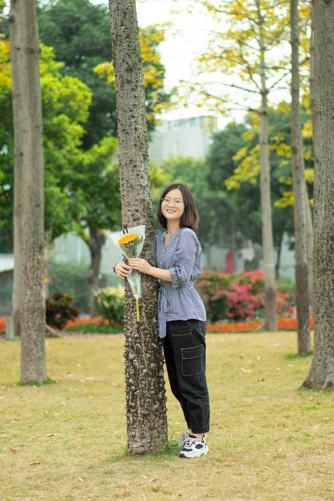

# 夏娟

- 栏目：机器视觉与智能感知教研室
- 日期：2026-04-29
- 原文：https://site.gcc.edu.cn/xydw/rgzn/jqsjyzngzjys1/b183416fdeef45c391f40b54ac433531.htm
- 照片：
  - 机器视觉与智能感知教研室\夏娟.jpg

夏娟，毕业于华南农业大学，硕士，讲师，主要从事人工智能、智慧农业等领域的教学与科研工作。主持并参与多项科研与教改项目，发表多篇学术论文与专利。
