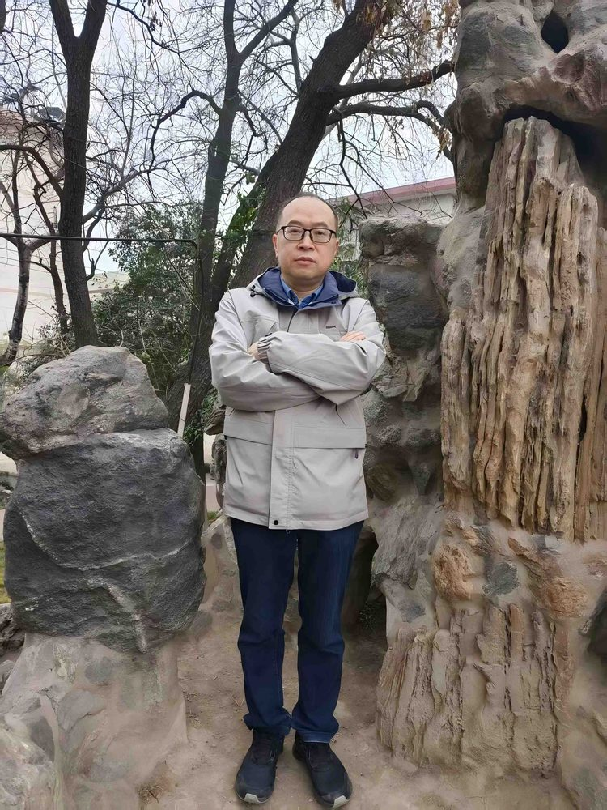

# 黄世奇

- 栏目：机器视觉与智能感知教研室
- 日期：2026-04-29
- 原文：https://site.gcc.edu.cn/xydw/rgzn/jqsjyzngzjys1/9b50cbd2acdf498abbc0a62030524f61.htm
- 照片：
  - 机器视觉与智能感知教研室\黄世奇.jpg

黄世奇，男，博士后，教授，研究生导师，现为广州商学院老师，广东省普通高校数字技术与数字经济创新团队负责人。研究方向：人工智能、遥感图像处理、模式识别、大数据与计算机应用。发表学术论文180余篇（SCI收录30多篇，EI收录70多篇），出版学术专著4部，他引1000多次。授权国防发明专利2项、国家发明专利17项。主持各类科研项目20项，其中国家自然科学基金等国家级项目3项、省自然科学基金重点等省级项目6项。获得各种奖励40余项，其中，省级科学技术奖二等奖3项，省级优秀教学成果奖二等奖3项，省级优秀科技论文奖15篇，军事重大理论优秀成果奖1项，厅级科学技术奖二等奖1项、自然科学奖一等奖1项，中国发明协会创新成果二等奖1项，获全国“百篇”优秀博士论文提名奖和全军优秀博士论文，获陕西省第九届青年科技奖荣誉称号。
