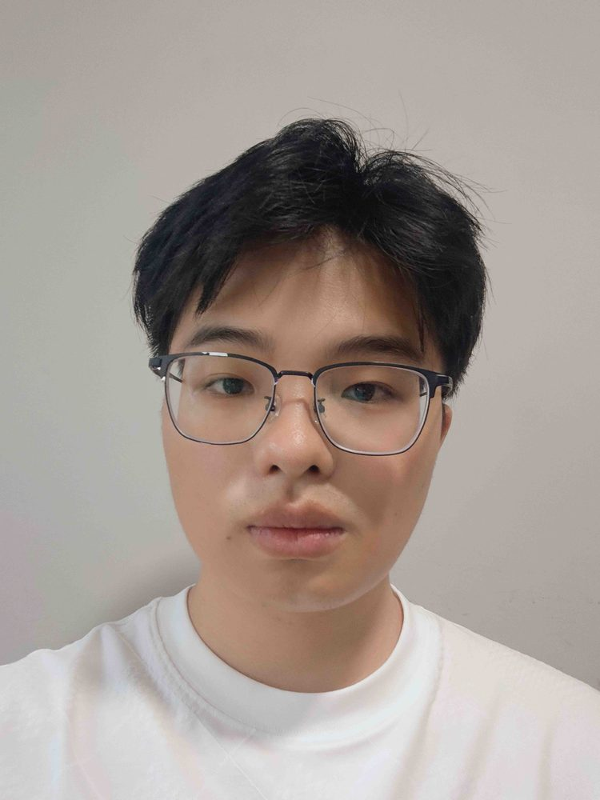

# 李威

- 栏目：网络安全工程教研室
- 日期：2026-05-06
- 原文：https://site.gcc.edu.cn/xydw/wlkjaqyszmt/wlaqgcjys/fac16a210f4a4b29815786177826b68c.htm
- 照片：
  - 网络安全工程教研室\李威.jpg

李威，男，助教，2020年获得湖南工业大学学士学位，2023年获得广州大学计算机技术专业硕士学位，主要负责网络空间安全，计算机基础等相关课程的教学工作。曾获得毕业论文优秀指导教师。
